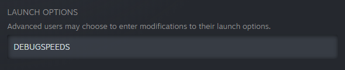
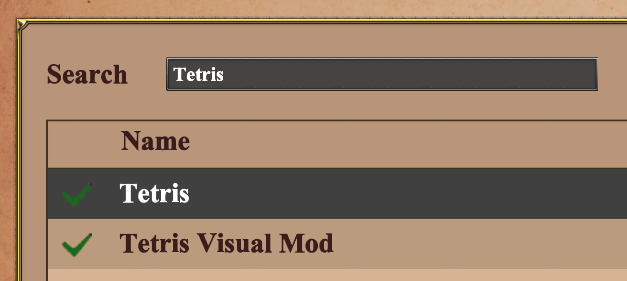

# Aoe2 Tetris

An implementation of Tetris that is playable as an Age of Empires II scenario.
The download link will be available on [https://www.ageofempires.com/mods](https://www.ageofempires.com/mods).

## Installation and Setup

To play Tetris, you must:

1. Enable x8 speed.
2. Subscribe to the mods.
3. Setup the xs file.
4. Setup hotkeys.
5. Select both the scenario and the data mod when launching the game.
6. Set the game speed to x8.

**Enable x8 speed.**
Right click Aoe2 DE in your Steam library.
Select Properties.
In the Launch Option textbox, type `DEBUGSPEEDS`.



**Subscribe to the mods.**
From Aoe2 DE's main menu, click the gear icon in the top right.
Then select Mods.
From the Browse Mods tab, search for "Tetris".
Select the mod and click Subscribe.
The mod will have a green check mark next to it when it finishes downloading.
Then search for and subscribe to "Tetris Visual Mod".
Turn this mod on when playing Tetris and off when playing other games.



**Setup hotkeys.**

From Aoe2 DE's main menu, click the gear icon in the top right.
Then select Options.
From the Hotkeys tab, use the dropdown menu on the right side to add a new hotkeys profile (see the Recommended Hotkeys section that follows).
Remember to switch back to your normal hotkey profile when finished playing Tetris.


**Setup the xs file.** The mod center currently does not install xs scripts (a new scenario feature) correctly, so you'll have to copy and paste the file into the correct folder.
Once the Tetris mod is downloaded, select it an click "Open Directory".
Inside of the xs folder is a file `tetris.xs`.
Now right click Aoe2DE in your Steam library and go to Manage > Browse Local Files.
Copy `tetris.xs` and paste it into `<your-aoe2-folder>\resources\_common\xs`.

**Launch the game.**
The scenario is launched by starting a single player game.
Use the first two dropdown menus in the top-right of the Game Settings.


**Set the game speed to x8.**
When the scenario launches, press your "Speed Game Up" hotkey (default `Numpad +`) to set the game to x8 speed.

### Recommended Hotkeys

This scenario utilizes the "Select All X" hotkeys to select buildings without moving the camera.
I recommend going to the Hotkeys tab of the options menu and creating a new hotkey profile specifically for Tetris.
You can click the plus sign at the top-right to add a new profile and then use the dropdown menu to switch among profiles.

These "Select All X" hotkeys are listed in the "Game Commands" hotkey group.
If you use the arrow keys, then you should also clear the "Scroll Commands".

An example set of hotkeys follows.

| Action                     | Hotkey                     | Key         |
| -------------------------- | -------------------------- | ----------- |
| Move Left                  | Select All Archery Ranges  | Left Arrow  |
| Move Right                 | Select All Blacksmiths     | Right Arrow |
| Rotate Clockwise           | Select All Stables         | Up Arrow    |
| Rotate Counterclockwise    | Select All Kreposts        | Z           |
| Soft Drop                  | Select All Monasteries     | Down Arrow  |
| Hard Drop                  | Select All Castles         | Space       |
| Hold                       | Select All Siege Workshops | C           |
| Begin Game or Reset        | Select All Universities    | N           |

The "Speed Game Up" and "Slow Game Down" hotkeys from the "Game Commands" hotkey group are also useful for putting the game at x8 speed.

### Known Issues

* The data mod replaces unit attack animations with explosions, but sometimes the units still play their attack animation briefly instead of exploding.
* Units may rarely have their graphics replaced incorrectly.

## Credits

Thanks to Among the Hidden for making the video "A Game of Tetris" that inspired this idea.
Go check out that video: [https://youtu.be/p_sSYYaWJ3k](https://youtu.be/p_sSYYaWJ3k)

Thanks also to Alian713 and to MrKirby for helping with the parsing library I used to generate the scenario files.
Check out the library here: [https://github.com/KSneijders/AoE2ScenarioParser](https://github.com/KSneijders/AoE2ScenarioParser)

## Implementation Details

This section contains notes I wrote for myself while implementing this scenario.
It describes some of the triggers and other tricks I used.
I'm not sure if it will make sense to anyone else, so read at your own risk.

### Hotkeys

The game uses the "Select All" hotkeys to implement player hotkeys without moving the camera.

| Action                     | Hotkey                     | Value |
| -------------------------- | -------------------------- | ----- |
| Move Left                  | Select All Archery Ranges  | 1     |
| Move Right                 | Select All Blacksmiths     | 2     |
| Rotate Clockwise           | Select All Stables         | 3     |
| Rotate Counterclockwise    | Select All Kreposts        | 4     |
| Soft Drop                  | Select All Monasteries     | 5     |
| Hard Drop                  | Select All Castles         | 6     |
| Hold                       | Select All Siege Workshops | 7     |
| Begin Game or Reset        | Select All Universities    | 8     |

The player has two of each building on the map.
The buildings begin the scenario being owned by the player, but are switched to the Gaia player at the beginning of the scenario.
Switching them from the player to Gaia ensures that the player does not recapture them without the use of the Change Ownership Effect.

There are two of each building on the map, one controlled by the player and the other controlled by Gaia.
The buildings are placed out of the way so they aren't visible near the main Tetris game.

Consider setting the line of sight of the buildings to 0 (and perhaps starting them as belonging to the Gaia player) so that the player never has vision of their location.

If players click buildings themselves, they may select multiple at once.
This behavior may be handled simply by establishing a priority, where one select is detected per game tick, with the highest priority selection disregarding all other selections.

Object Select Conditions are used to determine which building is selected and which hotkey is pressed.
The ownership of the selected building then is swapped with the other building (Player 1 to Gaia and Gaia to Player 1) in order to deselect the building.

### Storing the Hotkey Presses

At the beginning of the game loop, the first triggers work to collect the player's hotkey press and store them in a variable.
The value of that variable is then reset to 0 at the end of the game loop.
The value for a corresponding key press is stored based on the table.
Only one key is pressed per turn, with the highest building in the table (the one with the lowest value) being used if multiple hotkeys are pressed at once.

### Pieces, Colors, Units, and Civilizations

A Tetris piece is called a Tetromino and consists of a color and a shape.
Each piece is represented in this scenario by a distinct color and unique unit.

| Name  | Color  | Unit (Civilization)       |
| ----- | -----  | -------------------       |
| Z     | Red    | Berserk (Vikings)         |
| S     | Green  | Eagle Warrior (Mayans)    |
| O     | Yellow | Jaguar Warrior (Aztecs)   |
| I     | Cyan   | Teutonic Knight (Teutons) |
| T     | Purple | Samurai (Japanese)        |
| J     | Blue   | Woad Raider (Celts)       |
| L     | Orange | Huskarl (Goths)           |

### Game Tick Rate

The scenario is intended to be run at x8 speed, allowing for 8 game seconds per 1 IRL second.
That allows the game to process 8 user inputs per second.
The game engine checks for trigger execution once every game second.

### Tetromino Rotation Rules

Some links to Tetromino rotation rules.

* [https://tetris.wiki/Super_Rotation_System](https://tetris.wiki/Super_Rotation_System)
* [https://harddrop.com/wiki/SRS](https://harddrop.com/wiki/SRS)

### Score

Tetris scoring rules: [https://tetris.wiki/Scoring](https://tetris.wiki/Scoring)

TODO T-Spins

### Losing Condition

The game is over when a new Tetromino is blocked and cannot spawn.

### State Machine

At the start of a scenario, the player will be prompted to press a button to begin playing a game of Tetris.

When the game is finished, the final game state is frozen with the score.
The player can then play again.

States are changed based on the press (or absence of a press) of a hotkey activating triggers one each game tick.

### Game Board

The playable area of the game board consists of Invisible Objects.
The board displays 20 rows and 10 columns.
Each tile on the board consists of 4 Invisible Objects, each facing one direction.

Pieces are placed by setting these Invisible Objects to units using the Replace Object effect.

There are also three groups of 8 Invisible Objects on the right side of the board to display the next 3 Tetrominos.
And there is a final group of 8 Invisible Objects on the left side of the board to display the hold Tetromino.

### Tetromino Generation

We use the Fisher Yates algorithm to permute a list of 7 pieces randomly.
A simple implementation of this algorithm in Python is as follows.

```python
def fisher_yates(seq: List[Any]):
    """Randomly permutes `seq` in place."""
    # inv: seq[j:] is randomized.
    for j in range(len(seq)-1, 0, -1):
        i = random.randInt(0, j)
        seq[i], seq[j] = seq[j], seq[i]
```

Random integers are needed in order to implement the inner part of the algorithm's loop.
In order to generate random integers we use a sequence of triggers with the `Chance` condition.

The scenario editor consists of a list of triggers that are checked once every game second, essentially following this pseudocode:

```text
for t in trigger_list:
    if t.is_active and all(c.is_satisfied for c in t.conditions):
        for e in t.effects:
            e.execute()
```

Importantly, if we activate/deactivate a trigger, the effect takes place during the current game tick's iteration of this loop.
For example the following code displays `C` (on the current tick), then `D` (on the current tick), then `A` (on the subsequent tick).

```text
Trigger A -> disabled, displays "A"
Trigger B -> enabled, activates A, activates D
Trigger C -> enabled, displays "C"
Trigger D -> disabled, displays "D"
```

To generate random numbers, we use triggers with `Chance` conditions set up in a tree to generate probabilities.
The `Chance` conditions are the inner nodes of the tree, and the leaves are integers.
For each node, the `Chance` probability `p` is a number between `0` and `100`.
This number `p` is the probability of choosing the left path in the tree, and `100 - p` is the probability of choosing the right path in the tree.
The product of the probabilities from the root to a leaf is the probability of choosing that integer.

For example, to generate a random number from 0, 1, or 2, we used the following tree.

```text
    67
   /  \
  50   2
 /  \
0    1
```

The probability of generating each number is:

0. `0.67 * 0.5 = 0.33`
1. `0.67 * (1 - 0.5) = 0.33`
2. `1 - 0.67 = 0.33`

We generate the random numbers and perform the Fisher Yates algorithm in one game tick, iterating through the trigger list.

### Objectives

The player's current score, level, and number of lines cleared are displayed on the right side of the screen in the Objectives panel.

### Rotations

The rotations use the Super Rotation System described here: [https://tetris.wiki/Super_Rotation_System](https://tetris.wiki/Super_Rotation_System).

### Data Mod

Tetris is more fun with explosions.
This data mod supports changing around unit data to allow for units to explode when they are removed from the game board.
This mod must be selected in the single player menu when launching a game of Tetris.

Note that the dat file is not contained in the GitHub repository, but may be obtained by downloading the `Tetris Scenario` mod in game and selecting the button to browse the mod's files.

The data mod makes the following changes.

The Selection Sound for the following buildings have been changed from their original value to `-1 - None`:

* 49 - Siege Workshop
* 82 - Castle
* 87 - Archery Range
* 101 - Stable
* 103 - Blacksmith
* 104 - Monastery
* 209 - University
* 1251 - Krepost

The following units are modified:

* 534 - Elite Woad Raider
* 554 - Elite Teutonic Knight
* 555 - Elite Huskarl
* 560 - Elite Samurai
* 694 - Elite Berserk
* 726 - Elite Jaguar Warrior
* 752 - Elite Eagle Warrior

For both the Byzantines and Gaia, their attack graphics are set equal to their Dying and Undead Graphics.

These graphics are modified to have an empty delta followed by an explosion Petard delta.
The animation duration of each of these animations also is doubled.
The dying and undead graphics file are:

* 826 - Huskarl (Death), 1.25 -> 2.5
* 1086 - Samurai (Death), 1.5 -> 3
* 1164 - TeutonicKnight (Death), 1.5 -> 3
* 1372 - WoadRaider (Death), 1.2 -> 2.4
* 4225 - EliteBerserk (Death), 1 -> 2
* 5783 - EliteEagleWarrior (Death), 1.25 -> 2.5
* 6600 - JaguarWarrior (Death), 1.25 -> 2.5

And finally, while this unit is not modified, it's important enough that we make note of it.

* Explosion Petard - 12217

In the game, each of those units, as well as the invisible object, for all players, are modified to have 100 range.
They attack Fortified Walls, and these walls are healed when the units are stopped and replaced with invisible objects.

### Visual Mod

The visual mod replaces the sound file that plays whenever the player acquired units using the Change Ownership trigger so that it does not make any noise.
It replaces the file `Capture_Everything.wem`.

The duration in the `impact_petard.json` is also doubled from 1.5 to 3.
